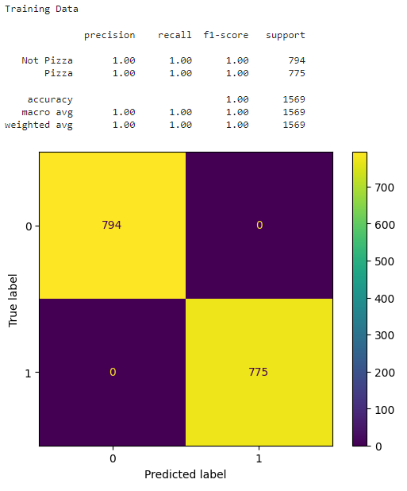
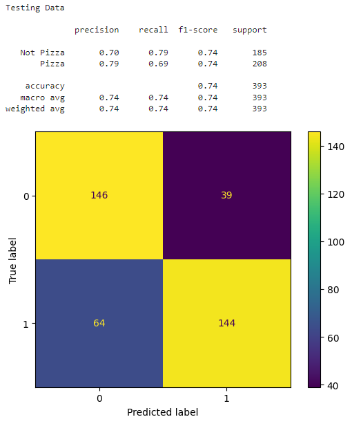
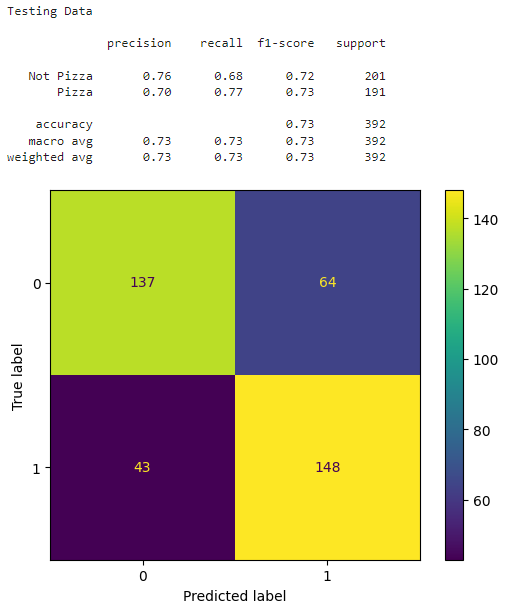
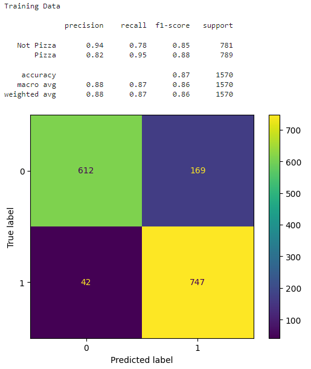
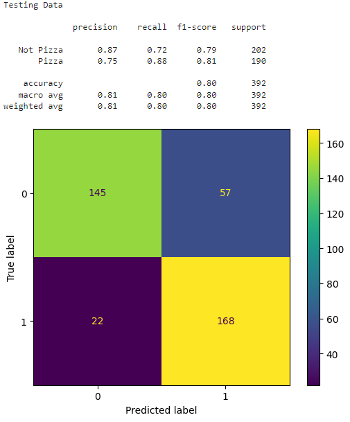

# ECS171 Final Group Project: Pizza/Not Pizza Image Classifier
Data set used for the project: https://www.kaggle.com/datasets/carlosrunner/pizza-not-pizza

## Introduction
For our final project, we decided to build an image classifier that determines whether a picture is of pizza or a different food. We selected this topic because it seemed fun and interesting, and everyone likes pizza. Also, the task of building the model seemed very manageable given the tools that we had learned throughout this course. We also felt that image classifiers were one of the more fascinating topics and this project allowed us to build a complete model on our own.

Building good predictive models can have larger impacts than we anticipate. While our model only works on pizza, it can easily be tweaked to a different image classifier by changing the input data. It can also be expanded upon by adding different labels for new categories of foods. In some cases, it can even be applied in unrelated topics, such as Hisashi Kambe's bakery image classifier that went on to be used for cancer identification!

## Methods

### Data Evaluation
Data evaluation was performed mostly via importing all images to a Keras dataset via the provided library function `image_dataset_from_directory`, and analyzing characteristics of the data with the outputted dataset. Manual review of all images was done before import to remove outstanding outliers (mostly photos in which the primary subject of the shot was not the food itself, such as with the pizza directory).

### Pre-Processing
The dataset consists of 983 images of pizza and 983 images of non-pizza foods - four outliers were culled, so we instead have 979 pizza images and 983 non-pizza food images. All images were resized by the provider to have either a width or height dimension of 512 pixels, with a varying dimension for the other dimension. While the Keras import will automatically resizes all images to 256x256, we additionally chose to crop all of the images such that we have uniform 1:1 square photos that are focused on the subject foods of each image via the Keras hyperparameter `crop_to_aspect_ratio`.

<br/>
<b>Figure 1: Pizza and Not Pizza Images</b><br/>

For models 1 and 3, we kept the images as a resolution of 256x256 and in RGB.

<br/>
<b>Figure 2: Gray-Scaled Pizza and Not Pizza Images</b><br/>

For model 2, we kept the images at a resolution of 256x256, but we gray-scaled the images. 

<br/>
<b>Figure 3: Lower Resolution Pizza and Not Pizza Images</b><br/>

For model 4, we kept the RGB channels of the images but downscaled the resolution to 64x64. 

All image pixel values will thus need to be normalized before being input to our model CNN — we implement this via a normalization/standardization layer implemented in our model such that all image data input is automatically normalized before entering the actual CNN. Per the documentation, image flattening is not particularly necessary depending on how the data is input to the model.

### First Model Pass
The first model is an initial test model based on previous homeworks and examples from TensorFlow documentation on implementation of a basic convolution neural network without any data augmentation, primarily using ReLu activations (with one final sigmoid activation for binary classification), with the Adam optimizer and binary cross-entropy as our loss model. 

```
model = tf.keras.Sequential([
  normalization_layer, # The normalizer/standardizer layer from pre-processing section
  tf.keras.layers.Conv2D(32, (3, 3), activation='relu', input_shape = (256, 256, 3)),
  tf.keras.layers.MaxPooling2D((2, 2)),
  tf.keras.layers.Conv2D(32, (3, 3), activation='relu'),
  tf.keras.layers.MaxPooling2D((2, 2)),
  tf.keras.layers.Conv2D(32, (3, 3), activation='relu'),
  tf.keras.layers.Flatten(),
  tf.keras.layers.Dense(128, activation='relu'),
  tf.keras.layers.Dense(1, activation="sigmoid")
])

# From the referenced Medium article, use the Adam optimizer 
# and binary cross-entropy, since we're making a binary classifier.
model.compile(
  optimizer=tf.keras.optimizers.Adam(),
  loss=tf.keras.losses.BinaryCrossentropy(),
  metrics=['accuracy'])
```

When training our model, we decided to use 10 epochs to speed up the time it takes to train.

```
# Ten epochs due to the speed of training
trainHistory = model.fit(train_data, epochs = 10)
```

### Second Model Pass

The second model is one of the new models that we built to test against our first model. One of the changes from our original model was the actual data. For this model, we gray scaled each of the pizza images. 

```
# Convert to grayscale (a float between 0-1) images and resize to 256x256 (default)
def load_images(filepath, size = (256, 256)):
    return np.asarray(Image.open(filepath).resize(size).convert('L')) / 255.0
```

Another change was to the convolutional neural network model itself. We removed three hidden layers: two Conv2D layers and one MaxPooling2D layer. 

```
model2 = tf.keras.Sequential([
  tf.keras.layers.Conv2D(32, (3, 3), activation='relu', input_shape=(256, 256, 1)),
  tf.keras.layers.MaxPooling2D((2, 2)),
  tf.keras.layers.Flatten(),
  tf.keras.layers.Dense(128, activation='relu'),
  tf.keras.layers.Dense(1, activation='sigmoid')
])
```

Besides the removal of these layers, the model has the same hidden layers with the same activation functions. The model is compiled the same as the first model with the Adam optimizer and binary cross-entropy loss model. It trains for the same number of epochs as the first model, which is 10.

### Third Model Pass

For the third model, we added new hidden layers, reduced the number of neurons per layer, and added a dropout layer. We added the dropout layer in between the first Dense layer. In addition, for each dense layer, we reduced the number of neurons from 128 to 16. Finally, we added two more dense layers each with a 'relu' activation function. 

```
model3 = tf.keras.Sequential([
  normalization_layer, # The normalizer/standardizer layer from pre-processing section
  tf.keras.layers.Conv2D(32, (3, 3), activation='relu', input_shape = (256, 256, 3)),
  tf.keras.layers.MaxPooling2D((2, 2)),
  tf.keras.layers.Conv2D(32, (3, 3), activation='relu'),
  tf.keras.layers.MaxPooling2D((2, 2)),
  tf.keras.layers.Conv2D(32, (3, 3), activation='relu'),
  tf.keras.layers.Flatten(),
  tf.keras.layers.Dense(16, activation='relu'),
  tf.keras.layers.Dropout(0.3),
  tf.keras.layers.Dense(16, activation='relu'),
  tf.keras.layers.Dense(16, activation='relu'),
  tf.keras.layers.Dense(1, activation="sigmoid")
])
```

The model is compiled the same way as models 1 and 2 with the Adam optimizer and the binary cross-entropy loss function. In addition, it trains for the same number of epochs, which is 10.

### Fourth Model Pass

For the final model, we made changes both to the data but also to the neural network. For the data, we downscaled the resolution from 256x256 to 64x64.

```
# This time, crop images to 64x64
finalData = tf.keras.utils.image_dataset_from_directory(
    "pizza_not_pizza",
    labels='inferred',
    label_mode='binary',
    color_mode='rgb',
    image_size=(64, 64),
    crop_to_aspect_ratio=True)
```

For the neural network model, we simplified everything about the model including the number of layers and number of neurons per layer. We removed a MaxPooling2D layer and Conv2D layer as well as reduced the number of neurons in the 'relu' dense layer. In addition, we reduced the kernel size of both of the Conv2D layer as well as adjusted the input_shape of the first Conv2D layer in accordance to the resolution change of input images explained above. 

```
modelF = tf.keras.Sequential([
    normalization_layer_64,
    tf.keras.layers.Conv2D(32, (2, 2), activation='relu', input_shape = (64, 64, 3)),
    tf.keras.layers.MaxPooling2D((8, 8)),
    tf.keras.layers.Conv2D(32, (2, 2), activation='relu'),
    tf.keras.layers.Flatten(),
    tf.keras.layers.Dense(32, activation='relu'),
    tf.keras.layers.Dense(1, activation="sigmoid")
])
```

The model is compiled the same way as models 1, 2, and 3 with the Adam optimizer and the binary cross-entropy loss function. It trains as well for the same number of epochs, which is 10.

## Results

### First Model Results

```
Epoch 1/10
50/50 [==============================] - 36s 712ms/step - loss: 1.2353 - accuracy: 0.5675
Epoch 2/10
50/50 [==============================] - 35s 703ms/step - loss: 0.6505 - accuracy: 0.6363
Epoch 3/10
50/50 [==============================] - 34s 675ms/step - loss: 0.5986 - accuracy: 0.6854
Epoch 4/10
50/50 [==============================] - 34s 677ms/step - loss: 0.5510 - accuracy: 0.7338
Epoch 5/10
50/50 [==============================] - 34s 674ms/step - loss: 0.4554 - accuracy: 0.7898
Epoch 6/10
50/50 [==============================] - 33s 653ms/step - loss: 0.3140 - accuracy: 0.8611
Epoch 7/10
50/50 [==============================] - 33s 656ms/step - loss: 0.2291 - accuracy: 0.9115
Epoch 8/10
50/50 [==============================] - 35s 693ms/step - loss: 0.1805 - accuracy: 0.9261
Epoch 9/10
50/50 [==============================] - 33s 665ms/step - loss: 0.1546 - accuracy: 0.9433
Epoch 10/10
50/50 [==============================] - 34s 678ms/step - loss: 0.1485 - accuracy: 0.9522
``` 
<br/>
<b>Figure 4: First Model's Training Data Classification Report</b><br/>
<br/>
<b>Figure 5: First Model's Testing Data Classification Report</b><br/>

For our first draft model, it expectedly has very good accuracy of 0.9522 and loss metrics of 0.1485 in training, but has conversely inadequate accuracy and loss when using testing data. As shown by the figures of classification reports, the training data shows a very high precision and recall for Pizza and Not Pizza around 0.98 to 0.99 and a very high accuracy of 0.99. However, in the testing data, the precision, recall, and accuracy are much lower. The overall accuracy for the testing data is 0.57. The precision and recall for Pizza and Not Pizza are 0.56 and 0.52 and also 0.59 and 0.53 respectively.

### Second Model Results

```
Epoch 1/10
50/50 [==============================] - 29s 562ms/step - loss: 2.5649 - accuracy: 0.5462
Epoch 2/10
50/50 [==============================] - 26s 521ms/step - loss: 0.5651 - accuracy: 0.6979
Epoch 3/10
50/50 [==============================] - 26s 528ms/step - loss: 0.3816 - accuracy: 0.8381
Epoch 4/10
50/50 [==============================] - 27s 541ms/step - loss: 0.3031 - accuracy: 0.8993
Epoch 5/10
50/50 [==============================] - 27s 533ms/step - loss: 0.1421 - accuracy: 0.9662
Epoch 6/10
50/50 [==============================] - 25s 510ms/step - loss: 0.0777 - accuracy: 0.9904
Epoch 7/10
50/50 [==============================] - 26s 512ms/step - loss: 0.0330 - accuracy: 0.9981
Epoch 8/10
50/50 [==============================] - 26s 516ms/step - loss: 0.0306 - accuracy: 0.9975
Epoch 9/10
50/50 [==============================] - 26s 526ms/step - loss: 0.0125 - accuracy: 1.0000
Epoch 10/10
50/50 [==============================] - 26s 511ms/step - loss: 0.0074 - accuracy: 1.0000
```
 <br/>
<b>Figure 6: Second Model's Training Results</b><br/>
<br/>
<b>Figure 7: Second Model's Testing Results</b><br/>

For the second model, during its training, it had a very low loss of 0.0074 and a very high accuracy of 1.0000. As shown by the classification reports figures above, from the training data, the model's results were very good with the precision, recall, and accuracy all being 1.00. However, from the testing data, it is, expectedly, lower than the training data's results. For Pizza and Non Pizza, the precision and recall are 0.79 and 0.69 and also 0.70 and 0.79 respectively. The accuracy is 0.74. In comparison to the first model, the second model, in terms of precision, recall, and accuracy is much higher.

### Third Model Results

```
Epoch 1/10
50/50 [==============================] - 33s 647ms/step - loss: 0.6761 - accuracy: 0.5828
Epoch 2/10
50/50 [==============================] - 30s 608ms/step - loss: 0.6426 - accuracy: 0.6242
Epoch 3/10
50/50 [==============================] - 31s 610ms/step - loss: 0.6241 - accuracy: 0.6478
Epoch 4/10
50/50 [==============================] - 31s 610ms/step - loss: 0.6013 - accuracy: 0.6955
Epoch 5/10
50/50 [==============================] - 32s 639ms/step - loss: 0.6019 - accuracy: 0.6854
Epoch 6/10
50/50 [==============================] - 31s 620ms/step - loss: 0.5669 - accuracy: 0.7032
Epoch 7/10
50/50 [==============================] - 31s 618ms/step - loss: 0.5115 - accuracy: 0.7338
Epoch 8/10
50/50 [==============================] - 31s 616ms/step - loss: 0.4545 - accuracy: 0.7656
Epoch 9/10
50/50 [==============================] - 31s 621ms/step - loss: 0.3976 - accuracy: 0.8032
Epoch 10/10
50/50 [==============================] - 31s 617ms/step - loss: 0.3855 - accuracy: 0.7981
```
<br/>
<b>Figure 8: Third Model's Training Results</b><br/>
<br/>
<b>Figure 9: Third Model's Testing Results</b><br/>

For the third model, during its training, it had a somewhat large loss of 0.3855 and a somewhat low accuracy of 0.7981 compared to the first and second model's training. In the classification reports shown above, we can see the metrics from the training data. The precision and recall of Pizza and Not Pizza are 0.89 and 0.91 and also 0.91 and 0.89 respectively. The accuracy is 0.90. While these metrics are lower than the first and second model, they are still fairly high. However, for the testing data, the precision and recall of Pizza and Not Pizza are 0.70 and 0.77 and also 0.76 and 0.68 respectively. The accuracy is 0.73. The precision, recall and accuracy are undoubtably higher than the first model's but comparable to the second model's.

### Fourth Model Results

```
Epoch 1/10
50/50 [==============================] - 1s 17ms/step - loss: 0.6687 - accuracy: 0.5854
Epoch 2/10
50/50 [==============================] - 1s 17ms/step - loss: 0.5579 - accuracy: 0.7204
Epoch 3/10
50/50 [==============================] - 1s 16ms/step - loss: 0.5306 - accuracy: 0.7287
Epoch 4/10
50/50 [==============================] - 1s 17ms/step - loss: 0.5070 - accuracy: 0.7605
Epoch 5/10
50/50 [==============================] - 1s 16ms/step - loss: 0.4844 - accuracy: 0.7828
Epoch 6/10
50/50 [==============================] - 1s 16ms/step - loss: 0.4568 - accuracy: 0.7987
Epoch 7/10
50/50 [==============================] - 1s 16ms/step - loss: 0.4250 - accuracy: 0.8057
Epoch 8/10
50/50 [==============================] - 1s 15ms/step - loss: 0.4164 - accuracy: 0.8210
Epoch 9/10
50/50 [==============================] - 1s 16ms/step - loss: 0.4093 - accuracy: 0.8166
Epoch 10/10
50/50 [==============================] - 1s 16ms/step - loss: 0.3742 - accuracy: 0.8420
```
<br/>
<b>Figure 10: Fourth Model's Training Results</b><br/>
<br/>
<b>Figure 11: Fourth Model's Testing Results</b><br/>

For the fourth model, during its training, it had a fairly high loss of 0.3742 and a somewhat low accuracy of 0.8420 comparable to the third model's training metrics. As shown in the classification reports above, for the training data, the precision and recall of Pizza and Not Pizza are 0.82 and 0.95 and also 0.94 and 0.78 respectively. The accuracy is 0.87. The precision, recall, and accuracy is very comparable to the third model. However, for the testing data, the precision and recall of Pizza and Not Pizza are 0.75 and 0.88 and also 0.87 and 0.72 respectively. The accuracy is 0.80, which is the highest accuracy out of all the models.

## Discussion
Now, let's discuss our different model performances as well as our process of designing them.
### First Model
For our first model, we followed a design based on previous models that we have built for homework assignments, as well as Tensorflow documentation. This model was a preliminary attempt to get baseline results that we could improve upon. The performance on our testing data was not great, at only 59% accuracy. These results are understandable, as it was our first blind attempt. The accuracy is decent, but there is definitely room for improvement.
### Second Model
Our second model explored an additional method of data preprocessing through grayscaling all images of our dataset. This involves converting the RGB values of each pixel into a singular value. We removed a few hidden layers from the first model, yet found that the performance greatly improved. The accuracy of our second model jumped to 74%! As we can see, the image grayscaling resulted in an improvement in the performance of our model. The model performed perfectly on the training data, which could potentially be a sign of overfitting, but the performance on testing data is still quite good.
### Third Model
For our third model, we explored models with different numbers of layers and nodes to find a higher accuracy. We experimented with changes until finding a model configuration that produced favorable results. We settled on adding a few more hidden layers and reducing the number of nodes per layer. More specifically, we added 2 more hidden layers and reduced nodes per layer. This model's 73% accuracy is comparable to our second model, but still better than our baseline. It's likely that there exists an even better model configuration that yields higher accuracy, but given our limited resources and time, this model seemed to perform quite well.
### Fourth Model
Our final model used a combination of model configuration changes and data preprocessing and produced our best results. At an 80% accuracy, it easily beats out our baseline model, as well as our other two. We found these results fascinating, due to the changes that caused them. Downscaling the images to a smaller resolution and simplifying the model architecture resulted in our most accurate model! It appears that we found an effective preprocessing strategy and a model that fit our dataset the best. The model's performance on the training data and testing data is similar, which signals that there overfitting in this model either.

## Conclusion
This project allowed us to use various skills that we have learned throughout this course to build a pizza image classifier. We built a convolutional neural network and explored different methods to improve its accuracy. We discovered that finding good performing model configurations takes a bit of luck in making the right changes. We found that different data pre-processing methods can greatly improve the performance of our models. Perhaps with more time and faster computing, we could have found an even more accurate model — some additional methodologies could include data augmentation and implementation of a validation set while training. As mentioned in the introduction, this project can definitely be expanded upon in the future. We could add new labels and work our way up to a general food classifier that can recognize a variety of different dishes. We could continue searching for that optimal model that yields the highest accuracy. But overall, we our satisfied with our results. We learned a lot through testing different models and are satisfied with our results.

## Collaboration
Michael Dinh - Writing/Programming: Data Evaluation and pre-processing sections of the writeup + proofreading, code and documentation for the first model / model evaluation, and overall Jupyter Notebook organization

Sheng Liu - Writing/Programming: Code and documentation for the second model

Sam Louderback - Writing/Programming: Code and documentation for the third model

Nima Bayati - Writing/Programming: Code and documentation for the final model

Richmond Ballesteros - Writing: Methods and results sections of the writeup

Aaron Wong - Writing: Introduction, discussion, and conclusion sections of the writeup
