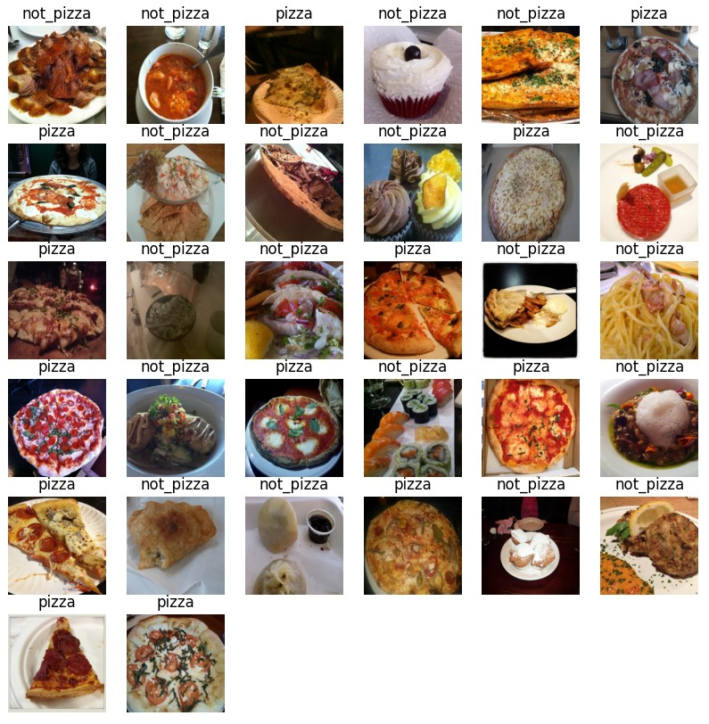
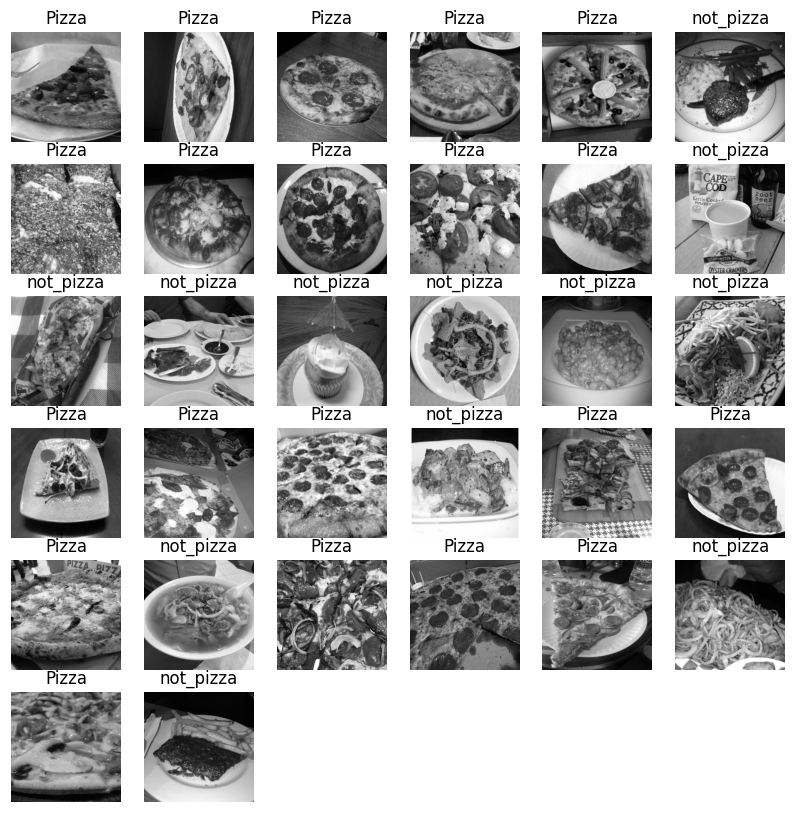
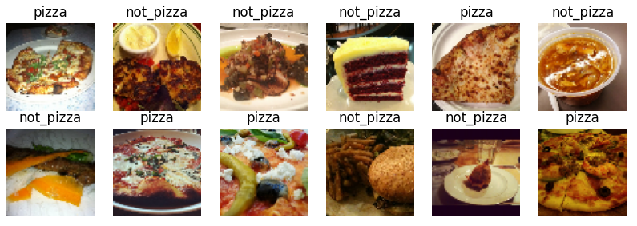
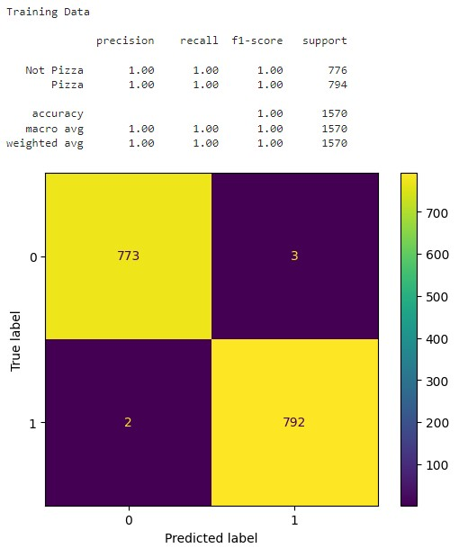
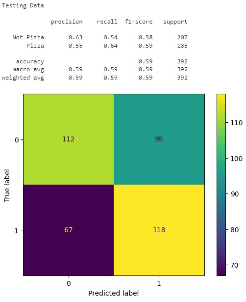

# ECS171 Final Group Project: Pizza/Not Pizza Image Classifier
Data set used for the project: https://www.kaggle.com/datasets/carlosrunner/pizza-not-pizza

## Introduction
For our final project, we decided to build an image classifier that determines whether a picture is of pizza or a different food. We selected this topic because it seemed fun and interesting, and everyone likes pizza. Also, the task of building the model seemed very manageable given the tools that we had learned throughout this course. We also felt that image classifiers were one of the more fascinating topics and this project allowed us to build a complete model on our own.

Building good predictive models can have larger impacts than we anticipate. While our model only works on pizza, it can easily be tweaked to a different image classifier by changing the input data. It can also be expanded upon by adding different labels for new categories of foods. In some cases, it can even be applied in unrelated topics, such as Hisashi Kambe's bakery image classifier that went on to be used for cancer identification!

## Methods

### Data Evaluation
Data evaluation was performed mostly via importing all images to a Keras dataset via the provided library function `image_dataset_from_directory`, and analyzing characteristics of the data with the outputted dataset. Manual review of all images was done before import to remove outstanding outliers (mostly photos in which the primary subject of the shot was not the food itself, such as with the pizza directory).

### Pre-Processing
The dataset consists of 983 images of pizza and 983 images of non-pizza foods - four outliers were culled, so we instead have 979 pizza images and 983 non-pizza food images. All images were resized by the provider to have either a width or height dimension of 512 pixels, with a varying dimension for the other dimension. While the Keras import will automatically resizes all images to 256x256, we additionally chose to crop all of the images such that we have uniform 1:1 square photos that are focused on the subject foods of each image via the Keras hyperparameter `crop_to_aspect_ratio`.

Figure 1: Pizza and Not Pizza Images   

For models 1 and 3, we kept the images as a resolution of 256x256 and RGB.

Figure 2: Gray-Scaled Pizza and Not Pizza Images   

For model 2, we kept the images at a resoltuion of 256x256, but we gray-scaled the images. 

Figure 3: Lower Resolution Pizza and Not Pizza Images   

For model 4, we kept the RGB of the images but downscaled the resolution to 64x64. 

All image pixel values will thus need to be normalized before being input to our model CNN — we implement this via a normalization/standardization layer implemented in our model such that all image data input is automatically normalized before entering the actual CNN. Per the documentation, image flattening is not particularly necessary here.

### First Model Pass
The first model is an initial test model based on previous homeworks and examples from TensorFlow documentation on implementation of a basic convolution neural network without any data augmentation, primarily using ReLu activations (with one final sigmoid activation for binary classification), with the Adam optimizer and binary cross-entropy as our loss model — as such, it expectedly has very good accuracy and loss metrics in training, but has conversely inadequate accuracy and loss when using testing data. Classification reports and confusion matrices are provided to give more insight into the behavior of the model here. Potential updates to improve this model would likely include data augmentation to diversify the range of data the model gets, internal changes to the model itself (such as with different hidden layers, activation functions, or hyperparameters), and/or inclusion of a validation data split (natively supported by Keras) to monitor the model's performance with non-training data.

### Second Model Pass

### Third Model Pass

### Fourth Model Pass

## Results

Figure 2: First Model's Training Results  

Figure 3: First Model's Testing Results  

## Discussion

## Conclusion

## Collaboration

